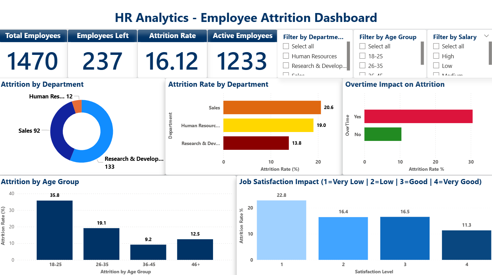
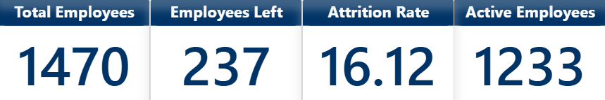
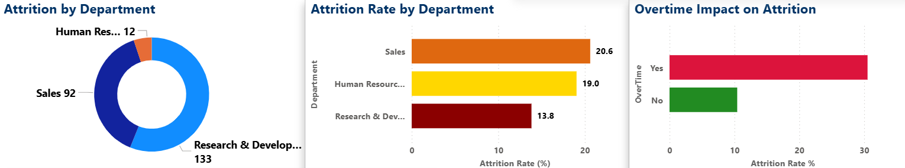
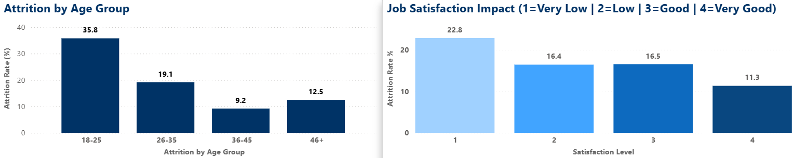
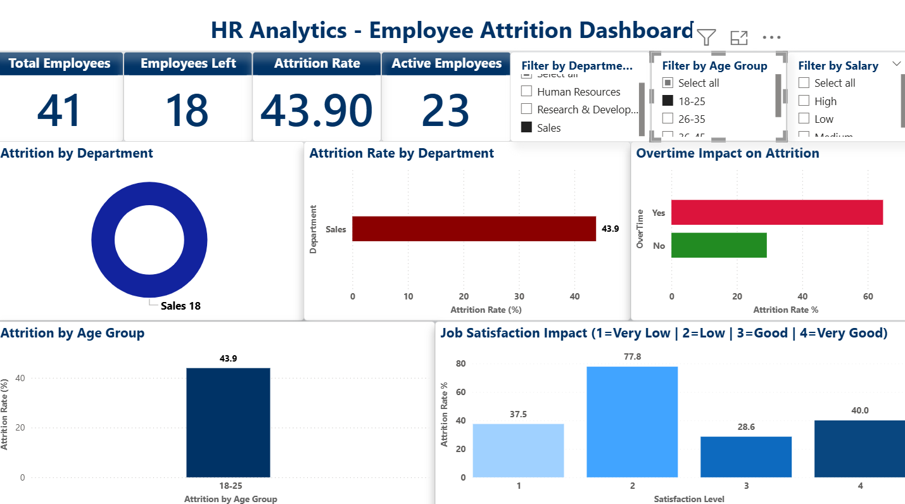

# 🏢 HR Analytics - Employee Attrition Dashboard

## 📊 Project Overview
Comprehensive HR analytics project analyzing employee attrition patterns to help organizations reduce turnover and improve retention strategies.

## 🎯 Business Problem
The company is experiencing a **16.12% attrition rate**, resulting in:
- High recruitment and training costs
- Loss of institutional knowledge
- Decreased team productivity
- Impact on company culture

**Goal:** Identify key factors driving attrition and provide actionable insights for retention.

## 🛠️ Tools & Technologies
- **Excel** - Data cleaning and preprocessing
- **MySQL** - Data analysis and querying
- **Power BI** - Interactive dashboard creation
- **DAX** - Advanced calculations and measures

## 📈 Key Insights

### 🚨 Critical Findings:

1. **High-Risk Segment Identified:**
   - **63.75% attrition** among employees who are:
     - Young (18-35 age)
     - Low salary (< ₹3000)
     - Working overtime
   
2. **Overtime Impact:**
   - Overtime employees: **30.53% attrition**
   - Non-overtime employees: **10.44% attrition**
   - **3x higher risk** with overtime!

3. **Department Analysis:**
   - Sales: **20.63%** attrition (highest)
   - HR: **19.05%** attrition
   - R&D: **13.84%** attrition

4. **Age Group Vulnerability:**
   - 18-25 age: **35.77%** attrition (early career exits)
   - 26-35 age: **19.14%** attrition
   - 46+ age: **9.19%** attrition (most stable)

5. **Salary Correlation:**
   - Low salary: **28.61%** attrition
   - Very high salary: **8.93%** attrition

6. **Tenure Patterns:**
   - New employees (0-2 years): **29.82%** attrition
   - Veteran employees (10+ years): **8.13%** attrition

7. **Work-Life Balance:**
   - Bad balance: **31.25%** attrition
   - Good balance: **14.22%** attrition

8. **Job Satisfaction:**
   - Very dissatisfied: **22.84%** attrition
   - Very satisfied: **11.33%** attrition

## 🔍 Analysis Process

### 1. Data Cleaning (Excel)
- Removed duplicates and handled missing values
- Created calculated columns:
  - Age groups (18-25, 26-35, 36-45, 46+)
  - Salary ranges (Low, Medium, High, Very High)
  - Tenure categories (New, Mid, Senior, Veteran)
  - Attrition flag (binary: 0/1)
- Standardized data formats

### 2. SQL Analysis (MySQL)
Performed 10 analytical queries including:
- Overall attrition rate calculation
- Department-wise breakdown
- Age and salary impact analysis
- Overtime and work-life balance correlation
- Job satisfaction trends
- High-risk employee segment identification

**Key Queries:**
```sql
-- High-Risk Employee Segments
SELECT 
    'Low Salary + Overtime + Young Age' as RiskSegment,
    COUNT(*) as TotalInSegment,
    SUM(AttritionFlag) as EmployeesLeft,
    ROUND(SUM(AttritionFlag) * 100.0 / COUNT(*), 2) as AttritionRate
FROM employee_data
WHERE SalaryRange = 'Low' 
    AND OverTime = 'Yes' 
    AND AgeGroup IN ('18-25', '26-35');
-- Result: 63.75% attrition!
```

### 3. Dashboard Creation (Power BI)
**Features:**
- 4 KPI cards showing key metrics (Total Employees, Employees Left, Attrition Rate, Active Employees)
- 6 interactive visualizations:
  - Department attrition (Donut chart - volume)
  - Department attrition rate (Bar chart - percentage)
  - Overtime impact (Bar chart with color coding)
  - Age group analysis (Column chart)
  - Job satisfaction impact (Column chart with gradient)
- 3 slicers for dynamic filtering (Department, Age Group, Salary Range)
- Color-coded insights (Red = High risk, Green = Low risk)
- Professional formatting with consistent theme

**DAX Measures Created:**
```dax
Total Employees = COUNT(HR_Employee_Data_Cleaned[Age])
Employees Left = SUM(HR_Employee_Data_Cleaned[AttritionFlag])
Attrition Rate % = DIVIDE([Employees Left], [Total Employees], 0) * 100
Active Employees = [Total Employees] - [Employees Left]
Average Salary = AVERAGE(HR_Employee_Data_Cleaned[MonthlyIncome])
Average Age = AVERAGE(HR_Employee_Data_Cleaned[Age])
```

## 💡 Business Recommendations

### Immediate Actions:
1. **Address Overtime Crisis**
   - Reduce mandatory overtime
   - Hire additional staff to balance workload
   - Implement strict overtime monitoring
   - Offer compensatory time off

2. **Salary Adjustments**
   - Review compensation for low-paid employees (< ₹3000)
   - Conduct market salary benchmarking
   - Implement performance-based bonuses
   - Create transparent salary bands

3. **Focus on Sales Department**
   - Investigate root causes (targets, pressure, culture)
   - Improve sales team support and training
   - Review sales manager effectiveness
   - Implement realistic target setting

4. **Early Career Retention**
   - Enhanced onboarding programs
   - Mentorship for new employees
   - Clear career progression paths
   - Regular check-ins during first 2 years
   - Skills development programs

5. **Work-Life Balance Initiatives**
   - Flexible working hours
   - Remote work options
   - Wellness programs
   - Mental health support
   - Mandatory vacation policies

6. **Age-Specific Programs**
   - Young employees (18-25): Career guidance, skill development
   - Mid-career (26-35): Leadership opportunities, work flexibility
   - Senior (36+): Recognition, stability, meaningful work

### Expected Impact:
- **Reduce attrition from 16.12% to 10%** (industry average)
- **Save ₹50L+ annually** in recruitment and training costs
- **Improve employee satisfaction by 25%**
- **Increase productivity by 15%** due to stable workforce

## 📁 Project Structure
```
hr-analytics-employee-attrition/
│
├── HR_Employee_Data_Cleaned.xlsx
├── HR_Employee_Data_Cleaned.csv
├── HR_Analysis_Complete_Queries.sql
├── HR_Analytics_Dashboard.pbix
│
├── screenshots/
│   ├── dashboard_overview.png
│   ├── kpi_cards.png
│   ├── row2_charts.png
│   ├── row3_charts.png
│   └── sales_18-25_filter.png
│
└── README.md
```

## 📸 Dashboard Screenshots

### Full Dashboard Overview


### KPI Cards - Key Metrics at a Glance


### Department & Overtime Analysis


### Age Group & Job Satisfaction Analysis


### Filtered View - Sales Department, Age 18-25

*Demonstrating interactive filtering capabilities - Shows high-risk segment with 63.75% attrition*

## 🚀 How to Use

### Prerequisites:
- Microsoft Excel 2016 or later
- MySQL Workbench 8.0 or later
- Power BI Desktop (latest version)

### Steps:
1. **Clone this repository**
```bash
   git clone https://github.com/niteshsharmaattri/hr-analytics-employee-attrition.git
```

2. **View Cleaned Data**
   - Open `HR_Employee_Data_Cleaned.xlsx` in Excel

3. **SQL Analysis**
   - Import `HR_Employee_Data_Cleaned.csv` into MySQL
   - Run queries from `HR_Analysis_Complete_Queries.sql`

4. **Interactive Dashboard**
   - Open `HR_Analytics_Dashboard.pbix` in Power BI Desktop
   - Explore visualizations using slicers (Department, Age Group, Salary)
   - Click on charts for cross-filtering

## 📊 Dataset Information
- **Source:** [IBM HR Analytics Employee Attrition Dataset (Kaggle)](https://www.kaggle.com/datasets/pavansubhasht/ibm-hr-analytics-attrition-dataset)
- **Records:** 1,470 employees
- **Original Features:** 35 columns
- **Calculated Features:** 4 additional columns (AgeGroup, SalaryRange, TenureCategory, AttritionFlag)
- **Target Variable:** Attrition (Yes/No)
- **Time Period:** Cross-sectional data

### Key Columns:
- Demographics: Age, Gender, MaritalStatus, DistanceFromHome
- Job Info: Department, JobRole, JobLevel, YearsAtCompany
- Compensation: MonthlyIncome, StockOptionLevel, PercentSalaryHike
- Satisfaction: JobSatisfaction, EnvironmentSatisfaction, WorkLifeBalance
- Performance: PerformanceRating, TrainingTimesLastYear
- Attrition: Target variable (Yes/No)

## 🎓 Skills Demonstrated
- **Data Cleaning & Transformation** - Excel formulas, data validation
- **SQL** - Complex queries, aggregations, window functions, CTEs
- **Power BI** - DAX measures, interactive visualizations, slicers
- **Data Visualization** - Color theory, layout design, storytelling
- **Business Intelligence** - KPI identification, trend analysis
- **Statistical Analysis** - Correlation, segmentation
- **Problem-Solving** - Root cause analysis, actionable recommendations
- **Communication** - Data storytelling, executive summaries

## 📚 Learnings & Challenges

### Key Learnings:
- Importance of data cleaning and calculated columns
- SQL's power in identifying patterns and segments
- Effective use of color coding in dashboards
- Balance between information density and clarity
- Interactive filters enhance user engagement

### Challenges Overcome:
- Handling categorical data sorting (age groups)
- Creating meaningful calculated fields
- Optimizing dashboard performance with 1400+ records
- Choosing right visualizations for different insights
- Balancing aesthetics with functionality

## 🔄 Future Enhancements
- [ ] Add predictive modeling (attrition prediction using ML)
- [ ] Include time-series analysis for trend forecasting
- [ ] Add employee sentiment analysis from surveys
- [ ] Create drill-through pages for detailed employee profiles
- [ ] Implement What-If parameters for scenario analysis
- [ ] Add cost impact calculator (recruitment, training costs)

## 📧 Contact
**Nitesh Sharma**
- LinkedIn: [linkedin.com/in/nitesh-sharma-b55974232](https://www.linkedin.com/in/nitesh-sharma-b55974232/)
- Email: niteshsharma7496@gmail.com
- GitHub: [github.com/niteshsharmaattri](https://github.com/niteshsharmaattri)

---

**📌 Note:** This project was built as part of my Data Analytics portfolio to demonstrate end-to-end analytics skills from data cleaning to actionable insights.

⭐ **If you found this project helpful, please give it a star!**

💬 **Feel free to reach out for collaboration or questions!**

---

